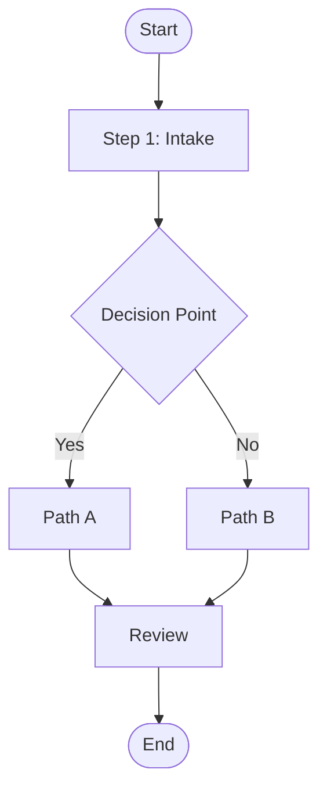
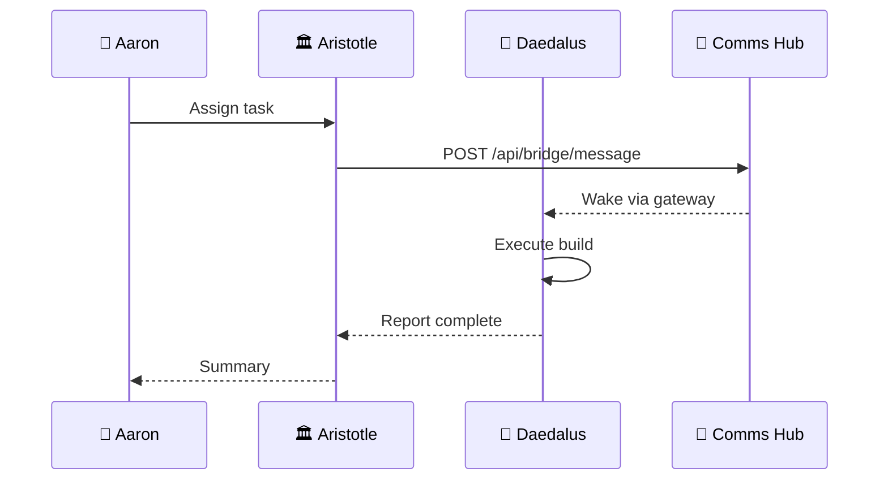
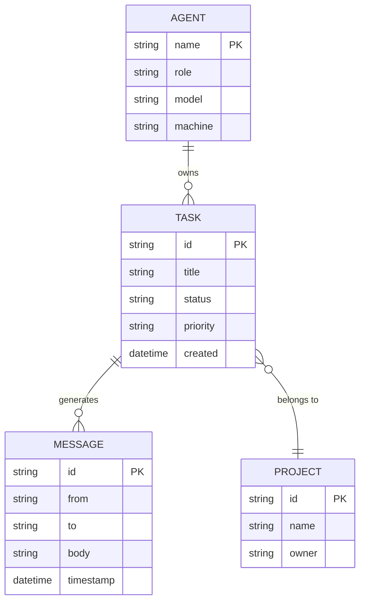
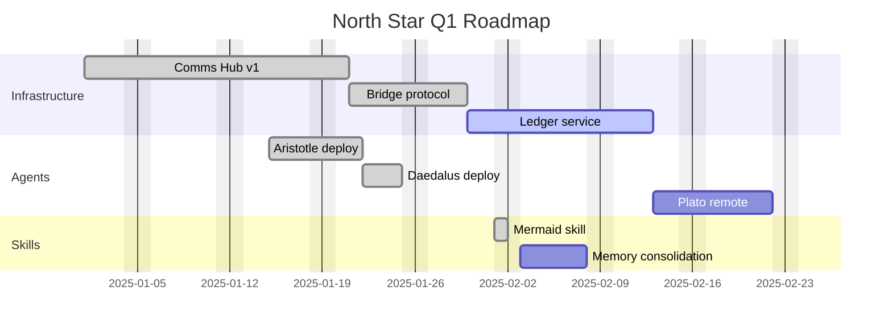
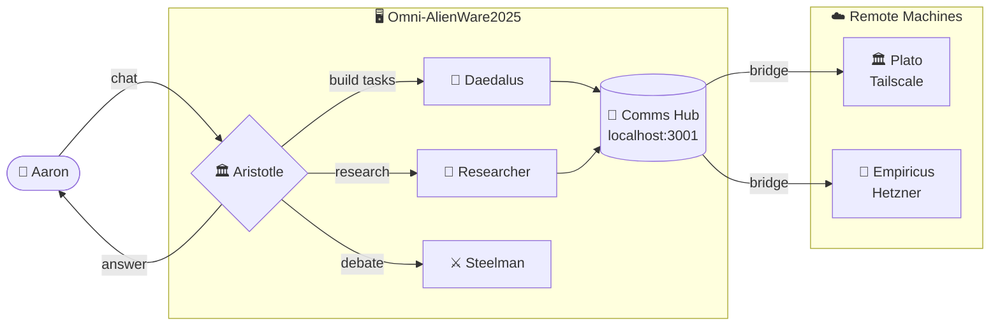
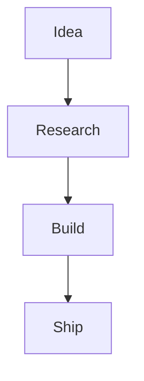
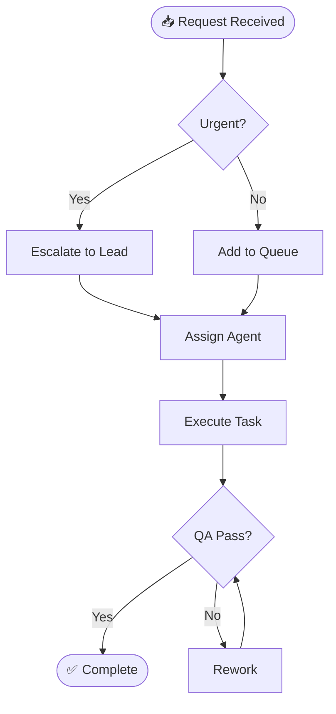
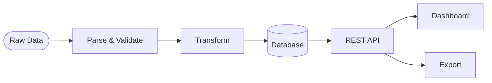

# Skill: Mermaid Diagrams 📊

Generate, save, and render Mermaid diagrams for flowcharts, sequence diagrams, ER diagrams, Gantt charts, and agent workflows.

## Quick Reference

| What you want | How |
|---|---|
| Render in browser | `http://localhost:3001/api/diagram?code=[URL-encoded syntax]` |
| Render via POST | `POST http://localhost:3001/api/diagram` with `{"code":"..."}` |
| Save as file | Write `.md` file to `C:\bravo-team\shared\diagrams\` |
| Embed in Obsidian | Wrap in ` ```mermaid ` code block — renders natively |
| Dashboard viewer | Open hub at `http://localhost:3001` → 📊 Diagrams tab |

---

## Diagram Types & Syntax

### 1. Flowchart (SOP / Process)

Use for: SOPs, decision trees, process flows.



**Direction modifiers:** `TD` (top-down), `LR` (left-right), `RL`, `BT`

**Node shapes:**
- `[Rectangle]` — standard step
- `(Rounded)` — soft step
- `([Stadium])` — start/end
- `{Diamond}` — decision
- `[(Database)]` — data store
- `((Circle))` — event

---

### 2. Sequence Diagram (Agent/System Communication)

Use for: agent conversations, API call flows, protocol documentation.



**Arrow types:**
- `A->>B: msg` — solid arrow (sync call)
- `A-->>B: msg` — dashed arrow (async/response)
- `A-)B: msg` — open async arrow
- `Note over A,B: text` — annotation

---

### 3. Entity-Relationship Diagram (Data Model)

Use for: database schemas, data relationships, system models.



**Cardinality:**
- `||--||` — exactly one to exactly one
- `||--o{` — one to zero-or-many
- `}o--o{` — zero-or-many to zero-or-many

---

### 4. Gantt Chart (Project Timeline)

Use for: project planning, sprint schedules, roadmaps.



**Task states:** `done`, `active`, `crit` (critical path), blank (future)

---

### 5. Agent Workflow (Architecture Diagram)

Use for: system architecture, agent topology, data flow.



---

## How to Save Diagrams

Save any diagram as a Markdown file in the shared diagrams directory:

```
C:\bravo-team\shared\diagrams\
```

**File format** — wrap in a mermaid code block:

````markdown
# Diagram Title

Brief description of what this shows.


**Author:** daedalus
**Created:** 2025-02-XX
**Tags:** #architecture #flowchart
````

**Naming convention:** `YYYY-MM-DD-descriptive-name.md`
Example: `2025-02-19-agent-workflow.md`

---

## Rendering via Hub

### Option 1: GET request (query param)
```javascript
const code = `graph TD\n    A-->B`;
const url = `http://localhost:3001/api/diagram?code=${encodeURIComponent(code)}`;
// Opens a dark-themed rendered HTML page
```

### Option 2: POST request (JSON body)
```javascript
const response = await fetch('http://localhost:3001/api/diagram', {
    method: 'POST',
    headers: { 'Content-Type': 'application/json' },
    body: JSON.stringify({ code: 'graph TD\n    A-->B' })
});
const html = await response.text();
```

### Option 3: Dashboard Viewer
1. Open `http://localhost:3001`
2. Click **📊 Diagrams** tab
3. Type/paste Mermaid syntax in the editor
4. Click **▶ Render** or it auto-renders live
5. Click **⛶ Full** to open in new tab
6. Click **🔗 Copy URL** to get a shareable link

---

## Obsidian Integration

Obsidian renders Mermaid natively. Just wrap any diagram in a mermaid code block in any `.md` file:

````markdown

````

No plugins needed — works out of the box.

---

## Quick Examples by Use Case

### SOP Flowchart


### Data Flow


---

## Tips

- **Obsidian renders live** — paste any diagram into a `.md` file and switch to Preview
- **URL length limit** — for very long diagrams, use POST instead of GET
- **Theme** — the hub always renders with `theme: 'dark'` — matches the aesthetic
- **Debug** — if a diagram doesn't render, check syntax at [mermaid.live](https://mermaid.live)
- **Subgraphs** — use `subgraph Name["Label"]` ... `end` to group nodes visually
- **Click events** — add `click NodeId href "url"` to make nodes clickable in rendered output
