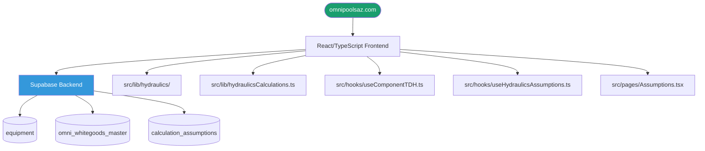

# OmniCalculator — Project Architecture Map
**Project:** Pool Engineering Calculator  
**URL:** https://omnipoolsaz.com  
**Team:** Plato (builds) + Empiricus (tests/validates)  
**As of:** 2026-02-23  

---

## System Architecture

## Key Modules
| Module | Purpose |
|--------|---------|
| `src/lib/hydraulics/` | TDH calculation engine, component TDH model |
| `src/lib/hydraulicsCalculations.ts` | Core hydraulics math |
| `src/hooks/useComponentTDH.ts` | React hook for component TDH |
| `src/hooks/useHydraulicsAssumptions.ts` | React hook for assumptions |
| `src/pages/Assumptions.tsx` | Admin page — equipment/whitegoods defaults |

## Supabase Tables (Single Source of Truth)
| Table | Purpose |
|-------|---------|
| `equipment` | Equipment catalog |
| `omni_whitegoods_master` | White goods master list |
| `calculation_assumptions` | Default assumption values |

## Current Status
- ✅ Hydraulics V2 — complete
- ✅ Component TDH model — built
- ✅ Equipment dropdowns — wired to DB
- ✅ Database-driven assumptions — live
- ⏳ **NEXT: Model A vs Model B comparison tool** (independent equipment selection)

## Canonical Locations (Ledger registered)
- **Repo:** `C:\North_Star_Projects\OmniCalculator` (Ledger #8)
- **DB:** `https://xuwalxiznpdtvpczqokh.supabase.co` (Ledger #9)  
- **Frontend:** `https://omnipoolsaz.com` (Ledger #10)
- **Managed by:** Lovable (git push via SSH, Nietzsche247)

## Team Protocol
- **Plato:** Builds features
- **Empiricus:** Tests and validates
- Both must register new resources in Ledger before creating: `POST http://100.108.47.36:3002/register`
