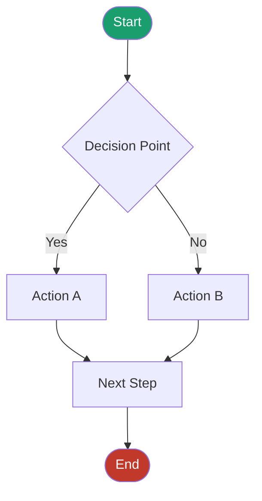
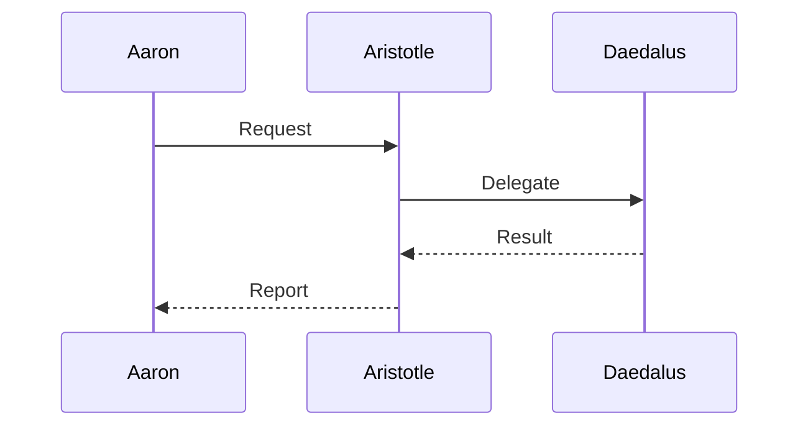

# SOP Template — Flowchart

Use this as a starting point for any SOP/process documentation.

## Process Diagram

## Sequence Diagram

## Notes
- Edit the mermaid code block directly in Obsidian
- Renders live in preview mode
- Save to C:\bravo-team\shared\diagrams\ for shared access
