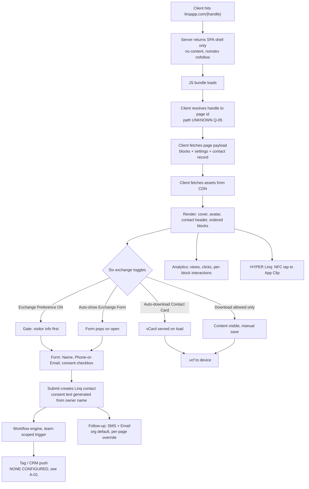
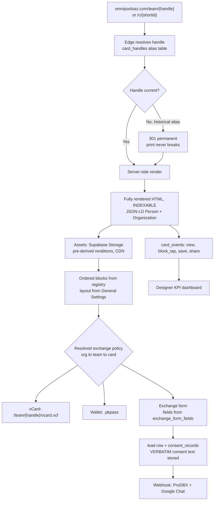

# OMNI CARD CODEX

**Canonical reference for the Omni digital business card: Linq reverse-engineering + the Omni rebuild spec.**

| | |
|---|---|
| Version | v1.0 |
| Snapshot | 2026-07-29 1518 MST |
| Supersedes | v0.1 (2026-07-29 1410) |
| Status | Object model VERIFIED against admin console. Schema restructured. Network layer still open. |
| Folder | `C:\Users\aaron\clawd-shared\card-docs\` |
| Naming | `OMNI_CARD_CODEX_YYYY-MM-DD_HHMM_vX.Y.md` (newest timestamp = current) |
| Owner | Aaron Baker |
| Scope | Linq observed behavior, the Omni canonical schema, the rebuild target on omnipoolsaz.com |

> **This is NOT a ProDBX artifact.** Keep it out of `prodbx-docs\` and out of the DBX CODEX. Cross-reference only. Same relationship the Reveal Card system has.

> **v1.0 is a major bump because the schema changed structurally.** Three ADRs in Section 14. The teams layer in ADR-001 invalidated the v0.1 template model. Do not work from v0.1.

---

## 0. READ THIS FIRST (for any session touching this project)

Three rules. Violating any one of them is how this project forks.

1. **One document.** This file is the only home for card architecture. Do not create `OMNI_CARD_SCHEMA.md`, `linq-notes.md`, `card-architecture-v2.md`, or any sibling. New information goes into the numbered section it belongs to. If no section fits, add a numbered section here and register it in the Capture Log.
2. **Every fact carries an evidence tier.** No untagged assertions. See Section 1. If you do not have evidence, the tier is `[U]` and it goes in the Capture Queue (Section 12). Never guess and never let an inference drift into looking like a confirmation.
3. **Append-only snapshots.** Read the latest-dated file. Duplicate it. Edit. Save as a NEW timestamped filename. Never overwrite. Log the change in Section 13.

Full enforcement protocol is Section 11. Read it before writing anything.

---

## ACTION ITEMS OUTSIDE THE REBUILD

Two findings from the 2026-07-29 admin console sweep are operationally urgent and independent of any rebuild. Do not let them get buried in an architecture document.

| # | Finding | Impact | Action |
|---|---|---|---|
| A-01 | **240 captured contacts are sitting in Linq with zero CRM connections.** All 13 CRM connectors are unconfigured. | 240 leads have never reached ProDBX, a mailing list, or a follow-up sequence. Every one of them was a person who handed over a phone number or email at a job site or showroom. | Export the 240 now. Decide the destination. **ProDBX is not among the 13 connectors**, so Zapier is the only bridge. |
| A-02 | Follow-up messages (SMS + Email) exist as an org default feature and appear unconfigured. | Contact exchange collects a consent-to-marketing checkbox from every visitor, and nothing is being sent. Consent collected and unused. | Decide whether Omni uses Linq follow-up at all, or whether exchange should route straight to ProDBX. |

A-01 is the larger one. It is a revenue question, not an architecture question.

---

## 1. EVIDENCE TIERS

Every factual line in Sections 2 through 8 is tagged. This is the mechanism that keeps a rebuild spec from quietly becoming fan fiction.

| Tag | Meaning | Promotion requires |
|---|---|---|
| `[C]` | CONFIRMED. Vendor documentation, official help center, or an Omni-executed test with a recorded result. | Nothing. This is the ceiling. |
| `[O]` | OBSERVED. Seen directly in DevTools, DOM, network tab, admin console, or rendered page. Must carry date + observer. | A vendor doc or a repeated Omni test to reach `[C]`. |
| `[I]` | INFERRED. Reasoned from an observation but not seen directly. | A direct observation to reach `[O]`. |
| `[U]` | UNKNOWN. Open question. Lives in the Capture Queue. | Any of the above. |

**Rule:** a session may only raise a tier when it records the evidence inline. Lowering a tier is always allowed and always logged. An `[I]` that turns out wrong gets struck through, not deleted, so future sessions do not re-derive the same wrong answer.

**Observer shorthand used in this file:** `BC1` = browser capture batch 1, admin console sweep, 2026-07-29.

---

## 2. VENDOR LANDSCAPE: WHAT EXISTS PUBLICLY

Answering the "has anyone built a skill for this" question directly.

| Question | Answer | Tier |
|---|---|---|
| Public API for Linq card/page content? | **No.** None. No endpoint documented for creating, reading, or updating page blocks. | `[C]` |
| Then what is `docs.linqapp.com`? | A **different product.** The Linq Partner API at `api.linqapp.com/api/partner/v3` is iMessage / RCS / SMS messaging infrastructure (Linq Blue). Chats, messages, attachments, webhooks. Nothing to do with business card pages. | `[C]` |
| Public integration surface for cards? | Zapier only, and it is **contact/lead side exclusively.** Triggers: New Contact Created, New Group Created. Actions: Create Contact, Update Contact, Upload Profile Photo to Contact, Create Group, Add Contact to Group, Find or Create Contact, plus raw authenticated HTTP. **No page or block objects exposed.** | `[C]` |
| API key location | Linq help center documents finding your API key via the Zapier connection flow. | `[C]` |
| Existing open-source Linq card clone or skill? | None found. `github.com/LinqApi/LinqAPI` is an unrelated .NET LINQ query library. Name collision only. | `[C]` |
| Bulk export of page content? | `[U]` Q-12 | `[U]` |

### What this means for the project

The card product is a **closed system observable only through its own client.** Every architectural fact about pages, blocks, and rendering has to be captured by watching the browser. That is why this codex leads with evidence tiers instead of a schema dump.

Second consequence, and the more important one: **do not model the Omni rebuild on Linq's internals.** Section 6 defines Omni's own canonical schema. Section 5 keeps a Linq-to-Omni mapping table so observations have somewhere to land without contaminating the target design.

---

## 3. LINQ OBSERVED ARCHITECTURE

### 3.1 Object model

The verified hierarchy. `[O] BC1`

```
Organization
  +-- Teams (0..n)
        +-- Members (0..n)
              +-- Pages (0..n)          -- page belongs to exactly 0 or 1 team
                    +-- Content Blocks (0..n, ordered)
Page Templates ----- sideways governance layer, scoped by team
Contacts ----------- the output
```

Current Omni instance census: `[O] BC1`

| Object | Count | Notes |
|---|---|---|
| Organizations | 1 | |
| Teams | 2 | Office (external id `2300`), TEAM OMNI (external id `5724`) |
| Members | 18 | |
| Pages | 21 | More pages than members. Function pages exist alongside people pages. |
| Page Templates | 3 | |
| Captured Contacts | 240 | **Zero CRM sync.** See A-01. |

**Team assignment is the load-bearing structural decision.** A page is assigned to exactly one team or None, and that assignment drives filtering, template inheritance, and workflow scoping simultaneously. `[O] BC1`

This invalidated the v0.1 schema, which bound templates directly to cards. See **ADR-001**.

Team external IDs are small sequential integers (`2300`, `5724`), which suggests a global integer sequence across all Linq tenants rather than per-org numbering. `[I]`

### 3.2 Domain map

| Host | Role | Tier |
|---|---|---|
| `linqapp.com` | Marketing site + app shell. Also the public card namespace at root. | `[C]` |
| `linqapp.com/{handle}` | Public card. Root-level namespace. | `[C]` |
| `linqapp.com/login` | Auth entry. | `[C]` |
| `linqapp.com/welcome` | Alternate web entry documented by the help center. | `[C]` |
| `linqapp.com/profile` | Authenticated page editor. | `[C]` |
| `api.linqapp.com` | API host. `/api/partner/v3` is the messaging product. Card app presumably uses a sibling path. | `[C]` host, `[I]` card path |
| `cdn.linqapp.com` | Asset/attachment CDN. Confirmed for the messaging product's attachments. | `[C]` for messaging, `[I]` for card images |
| `help-center.linqapp.com` | Help center. URL pattern `/en/articles/{id}-{slug}` indicates Intercom-hosted. | `[C]` |
| `buy.linqapp.com` | Hardware store. `/policies/terms-of-service` path pattern indicates Shopify. | `[C]` |

### 3.3 The public card page is a client-rendered SPA

Fetched `linqapp.com/ventura` on 2026-07-29. The HTML response contains **no card content whatsoever.** Only a shell with meta tags. All content is fetched and rendered client-side after load. `[O] 2026-07-29 / Claude via web_fetch`

Meta tags recovered from the shell:

| Meta | Value | Why it matters | Tier |
|---|---|---|---|
| `robots` | `noindex, nofollow` | **Linq cards are deliberately excluded from search engines.** Zero SEO value accrues to Omni from 21 pages. | `[O]` |
| `apple-itunes-app` | `app-id=1492946255, app-clip-bundle-id=com.linq.app.Clip, app-clip-display=card` | App Clip support. This is the HYPER Linq layer, see 3.7. | `[O]` |
| `apple-mobile-web-app-capable` | `yes` | Installable, standalone display. | `[O]` |
| `apple-mobile-web-app-status-bar-style` | `black` | | `[O]` |
| `viewport` | `viewport-fit=cover, width=device-width, initial-scale=1.0, minimum-scale=1.0, maximum-scale=1.0, user-scalable=no` | Notch-aware, pinch-zoom disabled. Engineered to feel native. | `[O]` |
| `format-detection` | `telephone=no` | Suppresses iOS auto-linking so Linq controls tel: rendering itself. | `[O]` |
| `msapplication-tap-highlight` | `no` | | `[O]` |
| `base` | `/` | Root-relative asset resolution. | `[O]` |

**The `noindex` finding is the single strongest argument for the omnipoolsaz.com rebuild.** Twenty-one pages with project photos and captions, invisible to every crawler. This connects directly to the known renovation/replaster AI-visibility gap: indexed designer pages carrying renovation project captions are exactly the content that closes it.

### 3.4 Page Settings, per page

Complete panel inventory. `[O] BC1`

| Control | Detail |
|---|---|
| **Handle** (Linq Page URL) | Editable slug. Free-form. Produces both people slugs (`/scott_culver`) and function slugs (`/construction`, `/info4`, `/OmniPools`). |
| **Choose Team** | None / TEAM OMNI / Office. Exactly one. |
| **Cover Photo** | With a combined "Cover + Profile Preview" so avatar overlap is visible before saving. |
| **Contact Exchange Settings** | Six independent toggles. See below. |
| **Customize Exchange Form** | Currently Name (Required) and Phone or Email (Required), with a `+` control to add fields. |

### 3.5 Contact exchange: six toggles

**Correction to v0.1, which recorded four.** There are six. `[O] BC1`

| # | Toggle | Function |
|---|---|---|
| 1 | Allow Contact Download | Lets any visitor save the owner's contact to their phone. |
| 2 | Auto-download Contact Card | Pushes the vCard automatically on page open. |
| 3 | **Contact Exchange Preference** | Asks the visitor for their info **before** handing over the owner's. |
| 4 | Auto-show Exchange Form | Pops the form immediately on open. |
| 5 | Contact Exchange Allowed | Master switch for visitor to owner exchange. |
| 6 | Use Linq's default exchange form? | Off means build your own. |

**Toggle 3 is not a boolean gate, it is a sequencing control.** That distinction was missing from v0.1 and it changes the resolver. See **ADR-002**. The v0.1 model treated all four known toggles as independent permission booleans; toggle 3 orders two events relative to each other, and toggle 6 selects between two form implementations. Three different semantic classes in one panel.

### 3.6 The live exchange form

Rendered sequence: `[O] BC1`

1. Name
2. Phone (with a full international country-code selector) **or** Email
3. Consent checkbox, worded as accepting communications and marketing from the named owner
4. Continue

**The consent line is generated from the page owner's name at render time.** There is a matching org-level GDPR marketing-opt-in switch. `[O] BC1`

This is a compliance finding, not a UI note. If Omni ever sends SMS to these contacts, the consent text as actually rendered and agreed to is the evidence. Generating it dynamically and never snapshotting it means there is no record of what any given contact agreed to. Section 6.10 adds `consent_records` storing the verbatim rendered string. Non-negotiable for TCPA exposure on 240 existing contacts.

### 3.7 Distribution surfaces: eight

`[O] BC1`

| Surface | Notes |
|---|---|
| Share Link | Raw `linqapp.com/{handle}` |
| Download QR Code | Encodes the handle URL, so a printed QR dies when a handle changes |
| Share as Text | Linq sends from a Linq number, attaches the contact card, creates the recipient as a Linq contact |
| Share as Email | |
| Add to Digital Wallet | Apple/Google Wallet pass |
| Create Virtual Background | Zoom background. Org controls upload permission, shared 1920x1080 library. |
| Create Email Signature | Team signature, syncs via Google Workspace |
| **HYPER Linq** | **Q-03 CLOSED.** The NFC badge / Apple App Clip layer. Org settings hold default App Clip settings for all members. |

**Architectural observation worth acting on:** all eight are renderings of one canonical URL. Build the page-URL primitive correctly and all eight fall out of it. This independently validates the routing design in Section 7. `[O] BC1`

### 3.8 Page overflow menu: nine actions

`[O] BC1`

Share Page / Edit Page Settings / Edit Follow-up Messages / **Create Page Template from Page** / **Add Content Block to Page** / Create Email Signature / Duplicate Page / Delete Page / **Edit Content Block Fields**

Three of these are the governance multipliers:

| Action | Why it matters |
|---|---|
| **Create Page Template from Page** | Promotes a good page into the org standard. Bottom-up template authoring. Whoever builds the best page defines the template. |
| **Add Content Block to Page** | Pushes a block outward to many pages rather than editing 21 by hand. |
| **Edit Content Block Fields** | Pushes a field change outward the same way. |

**This partially answers Q-02.** Template propagation is neither pure live-sync nor pure one-time-copy. It is **snapshot plus explicit operator-initiated push.** That is a better model than either option v0.1 considered, because a push is a discrete auditable event. See **ADR-001**. Still open: whether a push targets a team, all bound pages, or a hand-picked selection, and whether it overwrites member edits. Q-16.

### 3.9 Content blocks: sixteen types

**Q-01 CLOSED.** `[O] BC1`

| # | Linq type | Notes |
|---|---|---|
| 1 | Links | |
| 2 | Video Embed | YouTube / Vimeo |
| 3 | About Me | |
| 4 | Calendly Button | |
| 5 | Social Icons | 20 platforms, see 3.10 |
| 6 | Files | |
| 7 | Photo Gallery | |
| 8 | Expandable Text | |
| 9 | Reviews | Google / Yelp / Facebook |
| 10 | Team Directory | |
| 11 | Acuity Scheduling | |
| 12 | Spotify Player | |
| 13 | Soundcloud Player | |
| 14 | Typeform Embed | |
| 15 | Quick Contact | |
| 16 | Leads Form | Premium-badged |

The six that v0.1 could not identify: Social Icons, Acuity Scheduling, Spotify Player, Soundcloud Player, Quick Contact, Leads Form.

**Correction to v0.1:** the v0.1 registry invented `app_link` and `financing_link` as distinct types. They are not. The NPT AR app link and the HFS financing application are ordinary **Links** blocks. Removed. See **ADR-003**.

### 3.10 The four-tab editor shell

**Correction to v0.1, which recorded three tabs.** There are four, identical across all 16 block types. `[O] BC1`

| Tab | Contents |
|---|---|
| Edit Content | Type-specific payload |
| **General Settings** | Layout options, for example Grid vs List |
| Reorder | Child item ordering |
| Preview Content | |

Plus Save, and an unsaved-changes guard.

Universal per-block fields: `[O] BC1`

- **Section Header** on every block type
- For repeatable blocks: per-item **"Button Text (List Layout)"** plus a value field, with `+` / `-` row controls

Note the parenthetical: the per-item label is **layout-conditional**. It renders in List layout and presumably not in Grid. So child payload carries both a label and a value, and the layout selection decides whether the label is shown.

**The observer's read is correct and worth recording as a design principle:** one consistent editor shell across sixteen block types is why the product feels coherent. Copy the shell pattern, not just the block list. `[O] BC1`

**Social Icons platform list**, 20 total, 17 named: `[O] BC1`

Cash App, Etsy, Facebook, Instagram, LinkedIn, Open Sea, PayPal, Pinterest, Snapchat, Strava, Telegram, TikTok, Twitch, Venmo, WhatsApp, X, YouTube. Three unnamed. Q-17.

Only renders icons for accounts actually filled in. Empty means absent, not a broken icon.

### 3.11 Analytics

**Q-11 CLOSED, and v0.1 guessed wrong.** `[O] BC1`

| Surface | Contents |
|---|---|
| Rollup cards | Three: Past 24 Hours, Past 7 Days, All Time. Each showing **Views, Clicks, Click Rate %**. |
| Event Stream | Raw event view. |
| **Advanced Analytics** | **Interaction counts for every individual content block on the page.** Time Period selector: All Time / Past 24 Hours / Past 7 Days / Past 30 Days. |

**Linq already has per-block attribution.** v0.1 listed this as an Omni differentiator. It is parity, not a differentiator. Section 9 corrected. The actual Omni advantage is routing per-block events into the existing Designer KPI dashboard, not the measurement itself.

Observed granularity example: Text/Email/Call recorded 0 while a given link recorded 11. So the contact-action buttons are tracked as blocks too. `[O] BC1`

### 3.12 Follow-up and workflows

`[O] BC1`

**Follow-up messages:** two channels, Text (SMS) and Email. Defined as org defaults under Settings, overridable per page.

**Workflows:** a when-X-do-Y-for-team-Z engine. Observed builder fields:

| Field | Notes |
|---|---|
| Workflow Name | |
| Enabled | Toggle |
| Timing | Start and end dates |
| Teams | **Required scope.** A workflow must target a team. |
| Trigger | Catalog not enumerated |

Vendor example: a new contact triggers a tag plus a push to HubSpot.

Trigger and action catalogs could not be enumerated. The builder panel renders off-screen and the app auto-navigated away. Q-18.

Note the Teams-required scoping. Same pattern as template inheritance. Teams are the universal scoping dimension in this product, which is exactly why ADR-001 promotes them to a first-class entity.

### 3.13 Integrations

`[O] BC1`

**CRM connectors, 13, none connected:**

Calendly, GoHighLevel, GoHighLevel-new scopes, Google Contacts, HubSpot, Microsoft Contacts, Microsoft Dynamics CRM, Salesforce, Salesforce-Sandbox, Zapier, ZOHO, FollowUpBoss, Pipedrive

**ProDBX is not on the list.** Zapier is the only viable bridge to ProDBX. See A-01.

| Integration | State |
|---|---|
| SSO | Unconfigured. External config screen plus an "Allow non-SSO logins?" toggle. |
| HR sync | Access-gated behind a Request Access wall. Never evaluated. |
| Email Signature | Builds a team signature, syncs via Google Workspace. |

### 3.14 Org-level settings

`[O] BC1`

| Setting group | Contents |
|---|---|
| General Settings | Org name; GDPR marketing-opt-in switch; **"Show domain contacts?"** privacy switch that hides the org from non-members; org logo applied to all teams; deprecated org cover photo |
| Virtual Backgrounds | Separate permission controls for whether Team Admins and Team Members may upload their own artwork. Shared 1920x1080 library. |
| Message Snippets | Reusable text library for texts and emails |
| Hyper Linq | Default App Clip settings for all members |

Two things to note. First, permissions are split by role tier (Team Admin vs Team Member) at least for virtual backgrounds, implying a three-tier role model: org admin, team admin, team member. `[I]` Q-19. Second, the org logo applies to all teams, which is how eight member pages ended up with the Omni logo in the headshot slot. The logo was not a per-page default someone forgot to change; it is an org-level asset inherited into pages. That reframes the logo defect in 3.15.

### 3.15 Known operational defects in the current deployment

Each maps to a schema rule in Section 6.

| Defect | Instance | Root cause | Schema rule it forces |
|---|---|---|---|
| Handle collisions resolved by digit-suffixing | `michael_baker_7272`, `adam_schwartz99` | Root-level global namespace across all Linq tenants | Namespaced routing, 7.1 |
| Handles with trailing separators and mixed case | `Martin_Lopez_` | Free-form slug, no normalization on write | Handle normalization, 6.5 |
| Handle change breaks every distributed link | Pending for Michael, Martin, Adam | Mutable identifier embedded in the shared URL | Permanent alias table + immutable short ID, 6.5 / 7.2 |
| People pages and function pages share one namespace | `/scott_culver` next to `/construction`, `/info4`, `/OmniPools` | No page-purpose distinction in routing | `cards.purpose`, 6.4 |
| 21 pages for 18 members, unclear ownership | Includes the duplicate `/adamschwartz` | No single-owner constraint | One current primary per person, 6.4 |
| Admin login lands on admin dashboard | Michael Baker | Role determines landing route | 7.1 note |
| Org logo inherited into the headshot slot | All eight designer pages | **Org-level logo applied to all teams**, inherited where a member asset was expected | Required member fields resolve to NULL, never to an org inherited asset. 6.8 |
| 240 contacts, no CRM | Whole org | No connector configured, ProDBX unsupported | A-01 |

The logo defect is sharper than v0.1 recorded. It is not that a template supplied a default. It is that an **org-level brand asset was inherited into a slot that needed a member-level asset**, and inheritance silently succeeded. Any rebuild must distinguish "inherit from org" from "member must supply" at the field level, and the second must never fall back to the first.

---

## 4. FLOW ARCHITECTURE

### 4.1 Linq observed request flow



Nodes D and E remain the critical unknowns. Everything downstream of the form is now observed.

### 4.2 Omni target request flow



Four deliberate divergences from Linq:

1. **Server-side rendered and indexable.** Linq's `noindex` is discarded. This is the reason the rebuild exists.
2. **Handle changes never break a distributed link.** Alias table plus permanent 301.
3. **Consent text is snapshotted verbatim.** Linq generates it and does not appear to retain it.
4. **Leads reach ProDBX on capture.** Not 240 deep in a vendor console.

---

## 5. LINQ TO OMNI MAPPING

The airlock. Keeps reverse-engineered Linq concepts from leaking into the Omni schema as if they were design decisions.

| Linq concept | Omni entity | Divergence and why |
|---|---|---|
| Organization | `orgs` | Same. |
| **Team** | **`teams` + `team_members`** | **New in v1.0.** Promoted to first-class. Drives template inheritance, workflow scope, and page filtering. ADR-001. |
| Member | `people` | Same. |
| Page | `cards` | Same, plus an explicit `purpose` so people pages and function pages are distinguishable. Linq mixes them in one namespace. |
| Handle | `card_handles` | Split into a table. Every handle ever used retained permanently as a 301 alias. |
| Content block | `blocks` + `block_type_registry` | Payloads are JSONB validated against a registry row. Adding a type is a data insert. |
| Section Header | `blocks.section_header` | First-class column. Every Linq block type has one. |
| General Settings tab | `blocks.layout` + registry `layouts` | Renamed from v0.1's `display_mode` to match observed vocabulary. ADR-003. |
| "Button Text (List Layout)" | `block_children.label` + layout conditional render | Label is stored always, rendered per layout. |
| Page Template | `templates` scoped to `team_id` | Was card-bound in v0.1. Now team-scoped. ADR-001. |
| Create Page Template from Page | `templates.derived_from_card_id` | Bottom-up authoring, preserved with provenance. |
| Add Content Block to Page / Edit Content Block Fields | `template_pushes` | Explicit auditable push events, not silent live sync. ADR-001. |
| Six exchange toggles | `exchange_settings` at three scopes | Three semantic classes, not six booleans. ADR-002. |
| Customize Exchange Form | `exchange_form_fields` | |
| Consent checkbox | `consent_records` | **Verbatim text stored.** Linq generates and discards. |
| Contact | `leads` | Same. |
| Group | `lead_tags` | Renamed. "Group" collides with ProDBX and org-chart vocabulary. |
| Follow-up messages | `followup_messages` | Org default, team and card override. |
| Message Snippets | `message_snippets` | Same. |
| Workflow | `workflows` + `workflow_actions` + `workflow_team_scope` | Team scope is required, matching observed behavior. |
| Analytics rollups | `card_events` + materialized rollup | Windows match Linq: 24h / 7d / 30d / all time. |
| Virtual Background | `assets` rendition `vbg_1920` | Permission split by role tier. |
| Org logo | `orgs.logo_asset_id` | **Never inherited into a member-required field.** 3.14 / 3.15. |
| HYPER Linq | Deferred | Native App Clip requires an app. Keep NFC read and QR for v1. |
| CDN | Supabase Storage + CDN | Aaron already runs Supabase. No new vendor. |
| CRM connectors (13) | One normalized outbound webhook | Observer is right: the connectors are a single normalized new-contact event away. Build the event, not 13 integrations. |

---

## 6. OMNI CANONICAL SCHEMA

Postgres. Targets Supabase. **Normative.** Any change requires an ADR per 11.5.

### 6.1 Design decisions

| # | Decision | Rationale | Since |
|---|---|---|---|
| D-01 | Block payloads are JSONB validated against `block_type_registry` | Sixteen confirmed types. Per-type tables mean a migration per type. | v0.1 |
| D-02 | Block ordering is `numeric`, not `integer` | Fractional indexing. Reorder is one UPDATE. | v0.1 |
| D-03 | Every handle ever assigned is retained forever | The Martin Lopez problem. | v0.1 |
| D-04 | Print and NFC encode `/c/{shortid}`, never a handle | Physical media is unrecallable. | v0.1 |
| D-05 | Cards live under `/team/`, not site root | Root namespace forced `michael_baker_7272`. | v0.1 |
| D-06 | No per-card freeform CSS, ever | Largest fork vector in card products. | v0.1 |
| D-07 | Required member fields resolve to NULL, never to an org inherited asset | Org logo inherited into the headshot slot on all eight pages. | v0.1, sharpened v1.0 |
| D-08 | Assets store original plus pre-derived renditions | No client-side crop. Grids cannot go uneven. | v0.1 |
| D-09 | Pages are server-rendered and indexable | Reverses Linq's `noindex`. The reason the rebuild exists. | v0.1 |
| D-10 | `card_events` is append-only | Feeds the Designer KPI dashboard. | v0.1 |
| **D-11** | **Teams are a first-class scoping entity** | Observed: teams drive template inheritance, workflow scope, and filtering simultaneously. ADR-001. | v1.0 |
| **D-12** | **Template propagation is explicit auditable push, never silent sync** | Matches observed "Add Content Block to Page". A push is a logged event with a target set. ADR-001. | v1.0 |
| **D-13** | **Consent text is stored verbatim as rendered** | Dynamically generated consent with no snapshot is unusable as evidence. TCPA exposure. | v1.0 |
| **D-14** | **One normalized outbound lead event, not per-CRM connectors** | 13 connectors are renderings of one event. | v1.0 |
| **D-15** | **Setting resolution is a three-level chain: org, team, card** | Matches observed override pattern. Two levels is not enough; Linq has all three. | v1.0 |

### 6.2 Organizations, teams, people

```sql
create table orgs (
  id              uuid primary key default gen_random_uuid(),
  slug            text not null unique,
  legal_name      text not null,
  display_name    text not null,
  logo_asset_id   uuid,
  brand_token_set text not null default 'omni-default',
  gdpr_mode       boolean not null default false,
  hide_from_nonmembers boolean not null default false,
  created_at      timestamptz not null default now(),
  updated_at      timestamptz not null default now()
);

create table teams (
  id           uuid primary key default gen_random_uuid(),
  org_id       uuid not null references orgs(id) on delete cascade,
  name         text not null,
  legacy_linq_id text,
  status       text not null default 'active'
                 check (status in ('active','archived')),
  created_at   timestamptz not null default now(),
  unique (org_id, lower(name))
);

create table people (
  id            uuid primary key default gen_random_uuid(),
  org_id        uuid not null references orgs(id) on delete restrict,
  first_name    text not null,
  last_name     text not null,
  job_title     text,
  email         text,
  phone_e164    text,
  location      text,
  headshot_id   uuid,
  status        text not null default 'active'
                  check (status in ('active','inactive','departed')),
  created_at    timestamptz not null default now(),
  updated_at    timestamptz not null default now(),
  constraint phone_is_e164 check (phone_e164 is null or phone_e164 ~ '^\+[1-9][0-9]{7,14}$')
);

create table team_members (
  team_id    uuid not null references teams(id) on delete cascade,
  person_id  uuid not null references people(id) on delete cascade,
  role       text not null default 'team_member'
               check (role in ('team_member','team_admin','org_admin')),
  added_at   timestamptz not null default now(),
  primary key (team_id, person_id)
);

create index people_org_status_idx on people (org_id, status);
create index team_members_person_idx on team_members (person_id);
```

Seed for the current org:

| team | legacy_linq_id |
|---|---|
| Office | `2300` |
| TEAM OMNI | `5724` |

`legacy_linq_id` is text, not integer, so migration never has to guess about their sequence semantics.

Role enum mirrors the three tiers implied by the virtual-background permission split. Confirm via Q-19 before relying on it for authorization.

### 6.3 Block type registry

```sql
create table block_type_registry (
  type            text primary key,
  display_name    text not null,
  payload_schema  jsonb not null,
  has_children    boolean not null default false,
  child_schema    jsonb,
  layouts         text[] not null default '{}',
  provider        text,
  is_premium      boolean not null default false,
  is_active       boolean not null default true,
  version         integer not null default 1
);
```

Registry seed. Sixteen Linq types collapsed to eleven Omni types per **ADR-003**.

| Omni type | Covers Linq types | children | child payload | layouts |
|---|---|---|---|---|
| `about_text` | About Me | no | | |
| `links` | Links | yes | url, label, icon | `list`, `grid`, `button` |
| `photo_gallery` | Photo Gallery | yes | asset_id, caption, url | `grid`, `carousel` |
| `files` | Files | yes | asset_id, label | `list` |
| `expandable_text` | Expandable Text | yes | heading, body | `accordion` |
| `social_icons` | Social Icons | yes | platform, value | `row`, `grid` |
| `reviews` | Reviews | yes | platform, url | `row`, `list` |
| `team_directory` | Team Directory | yes | card_id | `grid`, `list` |
| **`media_embed`** | **Video Embed, Spotify Player, Soundcloud Player** | no | | `inline`, `thumbnail` |
| **`scheduling_embed`** | **Calendly Button, Acuity Scheduling** | no | | `button`, `inline` |
| **`form_embed`** | **Typeform Embed, Quick Contact, Leads Form** | no | | `inline`, `popup` |

The three consolidations are ADR-003. Linq ships seven separate provider-specific block types that differ only by which URL you paste. Modeling them as three generic types plus a `provider` field means adding Loom, Descript, or Cal.com later is a registry row, not an implementation.

```sql
create table embed_providers (
  provider     text primary key,
  block_type   text not null references block_type_registry(type),
  display_name text not null,
  url_pattern  text not null,
  oembed_endpoint text,
  is_active    boolean not null default true
);
```

Seed: `youtube`, `vimeo`, `spotify`, `soundcloud` for `media_embed`; `calendly`, `acuity` for `scheduling_embed`; `typeform` for `form_embed`.

```sql
create table social_platforms (
  platform     text primary key,
  display_name text not null,
  value_kind   text not null check (value_kind in ('handle','url','phone')),
  url_template text,
  icon_key     text not null,
  is_active    boolean not null default true
);
```

Seed from the 17 observed: `cashapp`, `etsy`, `facebook`, `instagram`, `linkedin`, `opensea`, `paypal`, `pinterest`, `snapchat`, `strava`, `telegram`, `tiktok`, `twitch`, `venmo`, `whatsapp`, `x`, `youtube`. Three unidentified, Q-17.

### 6.4 Cards

```sql
create table cards (
  id              uuid primary key default gen_random_uuid(),
  org_id          uuid not null references orgs(id) on delete restrict,
  team_id         uuid references teams(id) on delete set null,
  person_id       uuid references people(id) on delete set null,
  purpose         text not null default 'primary'
                    check (purpose in ('primary','event','campaign','function','company')),
  short_id        text not null unique,
  cover_asset_id  uuid,
  theme_token_set text not null default 'omni-default',
  status          text not null default 'draft'
                    check (status in ('draft','published','archived')),
  published_at    timestamptz,
  created_at      timestamptz not null default now(),
  updated_at      timestamptz not null default now(),
  constraint person_required_for_people_cards
    check (purpose <> 'primary' or person_id is not null)
);

create unique index cards_one_primary_per_person
  on cards (person_id, purpose)
  where purpose = 'primary' and status <> 'archived';

create index cards_org_status_idx on cards (org_id, status);
create index cards_team_idx on cards (team_id) where status = 'published';
```

`team_id` nullable matches Linq's None option. `purpose = 'function'` is the slot for `/construction`, `/info4`, `/OmniPools`, which explains 21 pages against 18 members.

`short_id`: 8 chars, Crockford base32 with ambiguous glyphs removed. These get read aloud and typed off printed material.

### 6.5 Handles and aliases

The most important table in the schema.

```sql
create table card_handles (
  id          uuid primary key default gen_random_uuid(),
  card_id     uuid not null references cards(id) on delete cascade,
  handle      text not null,
  is_current  boolean not null default true,
  assigned_at timestamptz not null default now(),
  retired_at  timestamptz,
  origin      text not null default 'assigned'
                check (origin in ('assigned','migrated_from_linq','renamed')),
  constraint handle_shape check (
    handle ~ '^[a-z0-9]([a-z0-9-]{1,28})[a-z0-9]$'
  ),
  constraint retired_consistency check (
    (is_current and retired_at is null) or (not is_current and retired_at is not null)
  )
);

create unique index card_handles_handle_unique on card_handles (lower(handle));
create unique index card_handles_one_current on card_handles (card_id) where is_current;

create table reserved_handles (
  handle text primary key,
  reason text not null
);
```

**Handle rules, normative:**

| Rule | Value |
|---|---|
| Charset | `a-z`, `0-9`, hyphen |
| Case | Lowercased on write |
| Length | 3 to 30 |
| Boundaries | Start and end alphanumeric |
| Underscores | Rejected. Hyphen only. |
| Collision | **Reject and prompt.** Never auto-append digits. |
| Reuse | Retired handles permanently burned |
| Change | Old row `is_current=false`, `retired_at=now()`. Resolver 301s forever. |
| Reserved | Site routes, `admin`, `api`, `team`, `c`, `login`, plus every existing omnipoolsaz.com path. Seed from a sitemap crawl. Q-15. |

Migration targets:

| Person | Linq handle | Omni handle | Note |
|---|---|---|---|
| Terry Devine | `terry_devine` | `terry-devine` | |
| Adam Schwartz | `adam_schwartz99` | `adam-schwartz` | Resolve duplicate `/adamschwartz` first. Q-14. |
| Dave Franklin | `dave_franklin` | `dave-franklin` | |
| Chloe Baker | `chloealyssabaker` | `chloe-baker` | |
| Michael Baker | `michael_baker_7272` | `michael-baker` | |
| Martin Lopez | `Martin_Lopez_` | `martin-lopez` | Case and trailing underscore eliminated |
| Ventura Vargas | `ventura` | `ventura-vargas` | Keep `ventura` as alias |
| Dylan Stern | `dylan_stern` | `dylan-stern` | |
| Scott Culver | `scott_culver` | `scott-culver` | Newly surfaced in BC1 |
| *function pages* | `construction`, `info4`, `OmniPools` | `construction`, `info`, `omni-pools` | `purpose = 'function'`. Audit all 21 before migrating. Q-20. |

Every Linq handle is seeded as a historical alias with `origin='migrated_from_linq'`.

### 6.6 Blocks

```sql
create table blocks (
  id              uuid primary key default gen_random_uuid(),
  card_id         uuid not null references cards(id) on delete cascade,
  type            text not null references block_type_registry(type),
  section_header  text,
  position        numeric not null,
  payload         jsonb not null default '{}',
  layout          text,
  provider        text references embed_providers(provider),
  is_visible      boolean not null default true,
  source          text not null default 'member'
                    check (source in ('member','template')),
  template_block_id uuid,
  member_edited_at  timestamptz,
  created_at      timestamptz not null default now(),
  updated_at      timestamptz not null default now()
);

create index blocks_card_position_idx on blocks (card_id, position) where is_visible;

create table block_children (
  id         uuid primary key default gen_random_uuid(),
  block_id   uuid not null references blocks(id) on delete cascade,
  position   numeric not null,
  label      text,
  payload    jsonb not null default '{}',
  asset_id   uuid,
  created_at timestamptz not null default now()
);

create index block_children_block_position_idx on block_children (block_id, position);
```

`block_children.label` is the "Button Text (List Layout)" field. Stored always, rendered conditionally on `blocks.layout`.

`member_edited_at` exists so a template push can decline to overwrite a block a member has customized. That behavior is Q-16 on the Linq side; on the Omni side it defaults to **do not clobber member edits.**

### 6.7 Assets

```sql
create table assets (
  id             uuid primary key default gen_random_uuid(),
  org_id         uuid not null references orgs(id) on delete restrict,
  uploaded_by    uuid references people(id) on delete set null,
  scope          text not null default 'member'
                   check (scope in ('org','team','member')),
  kind           text not null check (kind in ('image','video','document')),
  storage_bucket text not null,
  storage_path   text not null,
  original_filename text,
  mime_type      text not null,
  byte_size      bigint,
  width          integer,
  height         integer,
  checksum_sha256 text,
  alt_text       text,
  created_at     timestamptz not null default now(),
  unique (storage_bucket, storage_path)
);

create unique index assets_org_checksum_idx on assets (org_id, checksum_sha256)
  where checksum_sha256 is not null;

create table asset_renditions (
  id           uuid primary key default gen_random_uuid(),
  asset_id     uuid not null references assets(id) on delete cascade,
  rendition    text not null,
  storage_path text not null,
  width        integer not null,
  height       integer not null,
  format       text not null check (format in ('webp','avif','jpeg','png')),
  byte_size    bigint,
  created_at   timestamptz not null default now(),
  unique (asset_id, rendition, format)
);

alter table orgs add constraint orgs_logo_fk
  foreign key (logo_asset_id) references assets(id) on delete set null;
alter table people add constraint people_headshot_fk
  foreign key (headshot_id) references assets(id) on delete set null;
alter table cards add constraint cards_cover_fk
  foreign key (cover_asset_id) references assets(id) on delete set null;
alter table block_children add constraint block_children_asset_fk
  foreign key (asset_id) references assets(id) on delete set null;
```

`assets.scope` is new in v1.0 and it is the structural guard on D-07. An asset scoped `org` can never satisfy a `member_required` field. That is the constraint the org logo bypassed on all eight pages.

**Rendition set, normative:**

| rendition | Dimensions | Use |
|---|---|---|
| `avatar_256` | 256 x 256 | Contact header, team directory |
| `avatar_512` | 512 x 512 | Retina avatar, vCard PHOTO |
| `gallery_1024` | 1024 x 1024 | Photo Gallery grid. Matches Linq's stated optimum, server-derived. |
| `gallery_2048` | 2048 x 2048 | Lightbox |
| `cover_1600` | 1600 x 900 | Card cover |
| `cover_3200` | 3200 x 1800 | Retina cover |
| `og_1200` | 1200 x 630 | Open Graph, link previews |
| `vbg_1920` | 1920 x 1080 | Virtual background, matching Linq's library spec |

`og_1200` is required. Linq's own docs state link previews come from `og:title`, `og:description`, `og:image`, with Twitter Card as fallback. Every card must publish all three or every shared link renders as a bare URL.

**Storage layout:**

```
bucket: card-assets
  {org_slug}/originals/{asset_id}.{ext}
  {org_slug}/renditions/{asset_id}/{rendition}.{format}
```

Originals private. Renditions public-read behind CDN. Never serve an original.

### 6.8 Templates, pushes, and requirements

Restructured per **ADR-001**.

```sql
create table templates (
  id                 uuid primary key default gen_random_uuid(),
  org_id             uuid not null references orgs(id) on delete cascade,
  team_id            uuid references teams(id) on delete cascade,
  name               text not null,
  version            integer not null default 1,
  derived_from_card_id uuid references cards(id) on delete set null,
  status             text not null default 'draft'
                       check (status in ('draft','active','retired')),
  created_at         timestamptz not null default now(),
  unique (org_id, name, version)
);

create table template_blocks (
  id             uuid primary key default gen_random_uuid(),
  template_id    uuid not null references templates(id) on delete cascade,
  type           text not null references block_type_registry(type),
  section_header text,
  position       numeric not null,
  payload        jsonb not null default '{}',
  layout         text,
  fill_mode      text not null
                   check (fill_mode in ('org_fixed','member_required','member_optional')),
  member_locked  boolean not null default false
);

create table template_bindings (
  id          uuid primary key default gen_random_uuid(),
  template_id uuid not null references templates(id) on delete cascade,
  card_id     uuid not null references cards(id) on delete cascade,
  bound_at    timestamptz not null default now(),
  bound_via   text not null default 'team'
                check (bound_via in ('team','explicit')),
  unique (template_id, card_id)
);

create table template_pushes (
  id                uuid primary key default gen_random_uuid(),
  template_id       uuid not null references templates(id) on delete cascade,
  template_block_id uuid references template_blocks(id) on delete set null,
  action            text not null
                      check (action in ('add_block','update_fields','remove_block','reorder')),
  target_scope      text not null
                      check (target_scope in ('team','all_bound','selected')),
  target_card_ids   uuid[],
  clobber_member_edits boolean not null default false,
  pushed_by         uuid references people(id) on delete set null,
  pushed_at         timestamptz not null default now(),
  affected_count    integer,
  skipped_count     integer
);

create view binding_requirements as
select
  tb.card_id,
  t.id   as template_id,
  t.team_id,
  tbl.id as template_block_id,
  tbl.type,
  tbl.section_header,
  tbl.fill_mode,
  b.id   as block_id,
  (b.id is null or b.payload = '{}'::jsonb) as is_outstanding
from template_bindings tb
join templates t       on t.id = tb.template_id
join template_blocks tbl on tbl.template_id = t.id
left join blocks b
  on b.card_id = tb.card_id
 and b.template_block_id = tbl.id
where tbl.fill_mode = 'member_required';
```

Three things changed from v0.1:

1. `templates.team_id` scopes inheritance by team, matching observed behavior.
2. `templates.derived_from_card_id` preserves the "Create Page Template from Page" provenance. If a template came from Scott's page, that fact is worth keeping.
3. `template_pushes` replaces v0.1's `sync_mode` column entirely. Propagation is a logged event with a target set, an author, and a clobber flag defaulting to false. `affected_count` and `skipped_count` mean a push tells you how many pages it changed and how many it left alone because a member had edited them.

`fill_mode` remains the formalization of the yellow to-do box:

- `org_fixed` injected complete and locked. HFS financing, review links, misting fan, model pool.
- `member_required` injected with **empty payload**, and per D-07 plus `assets.scope`, an org asset cannot satisfy it. About Me, headshot, cover, project gallery.
- `member_optional` injected empty, never nagged.

### 6.9 Settings resolution: org, team, card

Three levels per **D-15** and **ADR-002**.

```sql
create table exchange_settings (
  id       uuid primary key default gen_random_uuid(),
  scope    text not null check (scope in ('org','team','card')),
  org_id   uuid references orgs(id)  on delete cascade,
  team_id  uuid references teams(id) on delete cascade,
  card_id  uuid references cards(id) on delete cascade,

  -- Class 1: permission gates
  contact_exchange_allowed  boolean,
  allow_contact_download    boolean,

  -- Class 2: sequencing and timing
  exchange_before_download  boolean,   -- Linq "Contact Exchange Preference"
  auto_show_exchange_form   boolean,
  auto_download_contact     boolean,

  -- Class 3: implementation selection
  use_default_form          boolean,

  -- Governance
  allow_child_override      boolean not null default false,
  updated_by  uuid references people(id) on delete set null,
  updated_at  timestamptz not null default now(),

  constraint scope_target_matches check (
    (scope = 'org'  and org_id  is not null and team_id is null and card_id is null) or
    (scope = 'team' and team_id is not null and org_id  is null and card_id is null) or
    (scope = 'card' and card_id is not null and org_id  is null and team_id is null)
  )
);

create unique index exchange_settings_org_uniq  on exchange_settings (org_id)  where scope = 'org';
create unique index exchange_settings_team_uniq on exchange_settings (team_id) where scope = 'team';
create unique index exchange_settings_card_uniq on exchange_settings (card_id) where scope = 'card';
```

**Resolution:** `coalesce(card, team, org)` per column, and a level is skipped entirely when its parent has `allow_child_override = false`. Nullable everywhere means "inherit."

The three comment groups are the point of ADR-002. v0.1 treated these as six equivalent booleans. They are not:

| Class | Columns | Semantics |
|---|---|---|
| Permission gate | `contact_exchange_allowed`, `allow_contact_download` | Is the capability available at all |
| Sequencing / timing | `exchange_before_download`, `auto_show_exchange_form`, `auto_download_contact` | When does it happen relative to page load and to each other |
| Implementation | `use_default_form` | Which form renders |

A resolver that treats sequencing flags as gates produces wrong behavior. `exchange_before_download = true` with `allow_contact_download = false` is contradictory and must be rejected at write time, not resolved at render time.

```sql
create table exchange_form_fields (
  id          uuid primary key default gen_random_uuid(),
  scope       text not null check (scope in ('org','team','card')),
  scope_id    uuid not null,
  field_key   text not null,
  label       text not null,
  field_type  text not null
                check (field_type in ('text','phone','email','phone_or_email','select','checkbox','consent','textarea')),
  is_required boolean not null default false,
  options     jsonb,
  position    numeric not null,
  is_active   boolean not null default true,
  unique (scope, scope_id, field_key)
);
```

Default seed matching observed Linq: `name` (text, required), `phone_or_email` (required), `consent` (consent, required).

`phone_or_email` is its own type because Linq renders one control satisfying either. Modeling it as two optional fields with a check constraint loses the UI intent.

### 6.10 Consent records

New in v1.0. **D-13.**

```sql
create table consent_records (
  id             uuid primary key default gen_random_uuid(),
  lead_id        uuid not null references leads(id) on delete cascade,
  card_id        uuid references cards(id) on delete set null,
  consent_text   text not null,
  owner_name_at_capture text not null,
  form_field_key text not null default 'consent',
  gdpr_mode      boolean not null default false,
  accepted       boolean not null,
  captured_at    timestamptz not null default now(),
  ip_hash        text,
  user_agent_hash text
);

create index consent_records_lead_idx on consent_records (lead_id);
```

`consent_text` is the **verbatim string as rendered to that visitor**, not a template ID and not a reconstruction. Linq generates the consent line from the owner's name at render time. If an owner's display name changes, or the consent wording is revised, every prior consent becomes unreconstructable.

This is the table that makes SMS follow-up defensible. Without it, "they consented" is an assertion. With it, it is a record.

Applies retroactively to A-01: the 240 existing contacts have consent that was collected and, as far as can be determined, not retained in a form Omni can produce. Treat their consent status as **unverified** until proven otherwise. Q-21.

### 6.11 Leads and analytics

```sql
create table leads (
  id            uuid primary key default gen_random_uuid(),
  org_id        uuid not null references orgs(id) on delete restrict,
  team_id       uuid references teams(id) on delete set null,
  card_id       uuid references cards(id) on delete set null,
  captured_via  text not null
                  check (captured_via in ('exchange_form','vcard_save','qr','nfc','sms_share','email_share','manual','imported_linq')),
  first_name    text,
  last_name     text,
  email         text,
  phone_e164    text,
  company       text,
  note          text,
  raw_payload   jsonb not null default '{}',
  synced_to     text[] not null default '{}',
  created_at    timestamptz not null default now()
);

create index leads_card_created_idx on leads (card_id, created_at desc);
create index leads_org_created_idx  on leads (org_id, created_at desc);
create index leads_team_created_idx on leads (team_id, created_at desc);

create table lead_tags (
  id     uuid primary key default gen_random_uuid(),
  org_id uuid not null references orgs(id) on delete cascade,
  name   text not null,
  unique (org_id, lower(name))
);

create table lead_tag_assignments (
  lead_id uuid not null references leads(id) on delete cascade,
  tag_id  uuid not null references lead_tags(id) on delete cascade,
  primary key (lead_id, tag_id)
);

create table card_events (
  id          bigserial primary key,
  card_id     uuid not null references cards(id) on delete cascade,
  event_type  text not null
                check (event_type in ('view','click','block_tap','contact_save','share','wallet_add','form_open','form_submit')),
  block_id    uuid references blocks(id) on delete set null,
  child_id    uuid references block_children(id) on delete set null,
  referrer    text,
  user_agent_hash text,
  country     text,
  occurred_at timestamptz not null default now()
);

create index card_events_card_time_idx on card_events (card_id, occurred_at desc);
create index card_events_type_time_idx on card_events (event_type, occurred_at desc);
create index card_events_block_idx on card_events (block_id, occurred_at desc);
```

`captured_via = 'imported_linq'` marks the 240 migrated contacts so they never get treated as freshly consented.

`child_id` is finer than Linq. Linq attributes to the block; this attributes to the individual gallery photo or link row. "Which project photo pulls" is answerable at the photo level.

Rollup view matching Linq's four windows:

```sql
create view card_analytics_rollup as
select
  c.id as card_id,
  w.window_label,
  count(*) filter (where e.event_type = 'view')  as views,
  count(*) filter (where e.event_type in ('click','block_tap')) as clicks,
  round(
    100.0 * count(*) filter (where e.event_type in ('click','block_tap'))
    / nullif(count(*) filter (where e.event_type = 'view'), 0)
  , 1) as click_rate_pct
from cards c
cross join (values
  ('past_24_hours', interval '24 hours'),
  ('past_7_days',   interval '7 days'),
  ('past_30_days',  interval '30 days'),
  ('all_time',      interval '100 years')
) as w(window_label, window_span)
left join card_events e
  on e.card_id = c.id
 and e.occurred_at >= now() - w.window_span
group by c.id, w.window_label;
```

### 6.12 Follow-up, snippets, workflows

```sql
create table message_snippets (
  id       uuid primary key default gen_random_uuid(),
  org_id   uuid not null references orgs(id) on delete cascade,
  name     text not null,
  channel  text not null check (channel in ('sms','email','any')),
  body     text not null,
  created_at timestamptz not null default now(),
  unique (org_id, lower(name))
);

create table followup_messages (
  id         uuid primary key default gen_random_uuid(),
  scope      text not null check (scope in ('org','team','card')),
  scope_id   uuid not null,
  channel    text not null check (channel in ('sms','email')),
  subject    text,
  body       text not null,
  delay_minutes integer not null default 0,
  is_active  boolean not null default false,
  updated_by uuid references people(id) on delete set null,
  updated_at timestamptz not null default now(),
  unique (scope, scope_id, channel)
);

create table workflows (
  id            uuid primary key default gen_random_uuid(),
  org_id        uuid not null references orgs(id) on delete cascade,
  name          text not null,
  is_enabled    boolean not null default false,
  starts_at     timestamptz,
  ends_at       timestamptz,
  trigger_type  text not null,
  trigger_config jsonb not null default '{}',
  created_at    timestamptz not null default now(),
  constraint timing_ordered check (ends_at is null or starts_at is null or ends_at > starts_at)
);

create table workflow_team_scope (
  workflow_id uuid not null references workflows(id) on delete cascade,
  team_id     uuid not null references teams(id) on delete cascade,
  primary key (workflow_id, team_id)
);

create table workflow_actions (
  id            uuid primary key default gen_random_uuid(),
  workflow_id   uuid not null references workflows(id) on delete cascade,
  position      numeric not null,
  action_type   text not null,
  action_config jsonb not null default '{}'
);

create index workflow_actions_wf_pos_idx on workflow_actions (workflow_id, position);
```

`trigger_type` and `action_type` are unconstrained text pending Q-18. Do not add CHECK constraints until the catalogs are enumerated; a wrong enum is worse than no enum.

`workflow_team_scope` is a join table because team scope was observed as required. At least one row must exist. Enforce in application logic or a deferred constraint trigger.

### 6.13 Outbound integration: one event

**D-14.** Thirteen CRM connectors are renderings of one normalized event.

```sql
create table outbound_endpoints (
  id           uuid primary key default gen_random_uuid(),
  org_id       uuid not null references orgs(id) on delete cascade,
  name         text not null,
  target_kind  text not null
                 check (target_kind in ('webhook','zapier','google_chat','prodbx','email')),
  url          text,
  secret_ref   text,
  event_types  text[] not null default '{lead.created}',
  is_active    boolean not null default true,
  created_at   timestamptz not null default now()
);

create table outbound_deliveries (
  id            bigserial primary key,
  endpoint_id   uuid not null references outbound_endpoints(id) on delete cascade,
  event_type    text not null,
  payload       jsonb not null,
  status        text not null default 'pending'
                  check (status in ('pending','delivered','failed','abandoned')),
  attempt_count integer not null default 0,
  last_error    text,
  next_attempt_at timestamptz,
  delivered_at  timestamptz,
  created_at    timestamptz not null default now()
);

create index outbound_deliveries_pending_idx
  on outbound_deliveries (next_attempt_at)
  where status = 'pending';
```

`secret_ref` is a reference to a secret store, never the secret. `outbound_deliveries` gives retry with backoff and an audit trail, which is what 240 unsynced contacts are the absence of.

---

## 7. ROUTING

### 7.1 Route table, normative

| Route | Method | Purpose | Index |
|---|---|---|---|
| `/team` | GET | Team directory | Yes |
| `/team/{handle}` | GET | Public card, SSR | Yes |
| `/team/{handle}/vcard.vcf` | GET | Generated vCard | No |
| `/team/{handle}/wallet.pkpass` | GET | Wallet pass | No |
| `/team/{handle}/qr.svg` | GET | QR encoding the `/c/{short_id}` URL | No |
| `/team/{handle}/signature` | GET | Email signature HTML | No |
| `/c/{short_id}` | GET | 301 to current `/team/{handle}` | No |
| `/team/{handle}/exchange` | POST | Exchange form submit | No |
| `/card-admin` | GET | Authenticated editor, lands on own card | No |
| `/card-admin/{card_id}` | GET | Card editor | No |
| `/api/cards/{card_id}/blocks` | CRUD | Block operations | No |
| `/api/templates/{id}/push` | POST | Template push, writes `template_pushes` | No |

**Handle resolution order** on `/team/{handle}`:

1. Lowercase the input.
2. Look up `card_handles` on `lower(handle)`.
3. No row: 404.
4. `is_current = true`: render.
5. `is_current = false`: **301** to the current handle for that `card_id`.

Step 5 is D-03. Never 302, never a soft redirect, never a "this page moved" interstitial.

**Function pages** use the same `/team/` namespace with `purpose = 'function'`. Keeping them in one namespace matches Linq and avoids a second resolver, but the `purpose` column means they can be excluded from `/team` directory listings and from team-scoped template pushes.

Admin landing: an authenticated admin lands on their **own card editor**, with the admin dashboard one click away. Michael should not have to navigate away from a dashboard to edit his own page.

### 7.2 Print and physical media

**Rule:** anything physical or unrecallable encodes `/c/{short_id}`. Never a handle.

| Medium | Encodes |
|---|---|
| NFC card | `omnipoolsaz.com/c/{short_id}` |
| Printed QR | `omnipoolsaz.com/c/{short_id}` |
| Email signature | `/team/{handle}` |
| SMS share | `/team/{handle}` |
| Business card print | `/team/{handle}` visible, QR encodes `/c/{short_id}` |
| ProDBX estimate DigiDoc | `/team/{handle}`, replacing the `#LINQ_PAGE_URL_HERE` placeholder |

That last row closes an open item in the DBX CODEX. Cross-reference, do not duplicate.

---

## 8. STYLING ARCHITECTURE

### 8.1 The rule

**No per-card CSS. No per-card color pickers. No freeform style fields. Ever.** D-06.

The moment one designer can set a hex value, you have eight brand identities and no way to roll out a change. A card references a **token set** by name. Token sets live in the repo under review.

Linq's own model supports this: the observed per-block control is a **layout** selector (Grid vs List) from a fixed set, not a style editor. Copy that constraint.

### 8.2 Token source

```css
:root {
  /* Brand palette */
  --omni-navy:        #1B2A4A;
  --omni-forest:      #1A3512;
  --omni-gold:        #C9A84C;
  --omni-steel:       #4A6FA5;
  --omni-wine:        #6B2D5B;

  /* Semantic surface */
  --card-bg:          #FFFFFF;
  --card-surface:     #F6F7F9;
  --card-ink:         var(--omni-navy);
  --card-ink-muted:   #5A6478;
  --card-line:        #E3E6EC;
  --card-accent:      var(--omni-gold);
  --card-cta-bg:      var(--omni-navy);
  --card-cta-ink:     #FFFFFF;

  /* Type */
  --font-display:     'Playfair Display', Georgia, serif;
  --font-body:        'DM Sans', system-ui, -apple-system, sans-serif;
  --fs-name:          clamp(1.5rem, 5vw, 2rem);
  --fs-title:         0.9375rem;
  --fs-body:          1rem;
  --fs-caption:       0.8125rem;
  --lh-body:          1.55;

  /* Rhythm */
  --sp-1: 4px;  --sp-2: 8px;  --sp-3: 12px; --sp-4: 16px;
  --sp-5: 24px; --sp-6: 32px; --sp-7: 48px;
  --radius-sm: 6px; --radius-md: 10px; --radius-pill: 999px;
  --shadow-card: 0 2px 12px rgba(27,42,74,.08);

  /* Layout */
  --card-max-w:     560px;
  --avatar-size:    112px;
  --cover-ratio:    16 / 9;
  --gallery-gap:    var(--sp-2);
  --gallery-cols:   3;
}
```

Fonts match the dashboards and web properties: DM Sans plus Playfair Display. ProDBX templates use Montserrat plus Lora because of email client constraints. Cards are web, so they follow the web pairing. The divergence is intentional and documented.

### 8.3 Block class contract

Every block renders inside a predictable wrapper. Block styling hangs off data attributes, never inline style.

```html
<section class="card-block"
         data-block-type="photo_gallery"
         data-layout="grid"
         data-provider=""
         data-block-id="{uuid}">
  <h2 class="card-block__header">{section_header}</h2>
  <div class="card-block__body"> ... </div>
</section>
```

A new block type ships a registry row plus one `[data-block-type="..."]` rule. A new embed provider ships an `embed_providers` row and nothing else.

### 8.4 The editor shell is the product

Recorded as a design principle because BC1 identified it correctly.

Sixteen block types, one editor shell: **Edit Content / General Settings / Reorder / Preview Content**, plus Save and an unsaved-changes guard, plus a Section Header on every type. That uniformity is why the product feels coherent to a designer who has never used it.

The Omni editor implements the same four tabs for all eleven types. No block gets a bespoke editor. If a type needs a control the shell cannot express, the shell gets the control, not the type.

### 8.5 Divergences from Linq's rendering

| Linq | Omni | Why |
|---|---|---|
| `user-scalable=no`, `maximum-scale=1.0` | Zoom permitted | Disabling pinch-zoom is an accessibility failure. Clients over fifty are a large share of the buyer pool. |
| `format-detection: telephone=no` | Keep, and render explicit `tel:` links | Same intent, correct implementation. |
| `noindex, nofollow` | Indexable, with JSON-LD `Person` + `Organization` | The reason the rebuild exists. |
| No structured data observed | JSON-LD on every card | Feeds the AI-visibility work, especially renovation queries. |
| Client-rendered | Server-rendered, hydrate for interactivity | Crawlable, survives a JS failure. |

---

## 9. WHAT V1 MUST DO THAT LINQ DOES NOT

Corrected in v1.0. Two v0.1 items were parity, not differentiation.

| # | Capability | Rationale |
|---|---|---|
| 1 | Indexable pages with structured data | Linq is `noindex`. Twenty-one pages of captioned project photos on your own domain is a durable content asset, aimed at the renovation visibility gap. |
| 2 | Handles that never break a distributed link | The Martin Lopez and Michael Baker problem, permanently. |
| 3 | Immutable short IDs on all print and NFC | Physical media cannot be recalled. |
| 4 | **Leads reach ProDBX on capture** | 240 contacts prove the vendor-console dead end. ProDBX is not among the 13 connectors. |
| 5 | **Verbatim consent snapshots** | Linq generates consent text from owner name at render and does not appear to retain it. |
| 6 | Three-level setting resolution with override permission | Linq has three scopes but lets a page override org policy freely. Omni gates override as a permission. |
| 7 | **Child-level event attribution** | Linq attributes to the block. Omni attributes to the individual gallery photo or link row. |
| 8 | Template pushes that decline to clobber member edits | `member_edited_at` + `skipped_count`. |
| 9 | Org assets structurally barred from member-required fields | `assets.scope`. Eight logos where headshots belong. |
| 10 | Live template completion query | `binding_requirements`. A number, not a meeting agenda item. |

**Removed from the v0.1 list as parity:**

| Was claimed | Reality |
|---|---|
| Per-block analytics | Linq has it. Advanced Analytics, per block, four time windows. Parity. |
| Server-derived square renditions | Linq documents 1024x1024 as optimal but the crop burden is on the user. Omni deriving it server-side is a real but minor improvement, not a headline. |

---

## 10. WHAT V1 MUST NOT DO

| Do not | Because |
|---|---|
| Ship per-card color or CSS controls | D-06. Immediate brand fork. |
| Auto-suffix a colliding handle | That is how `michael_baker_7272` happened. Reject and prompt. |
| Reissue a retired handle | Silently redirects an old client to the wrong designer. |
| Let an org asset satisfy a member-required field | Eight logos where headshots belong. |
| Add CHECK constraints to `trigger_type` / `action_type` before Q-18 | A wrong enum is worse than no enum. |
| Build sixteen block types | Eleven, with provider registries. ADR-003. |
| Build native NFC write or an App Clip | Requires an app. Keep NFC read and QR. Defer. |
| Build 13 CRM connectors | One normalized event. D-14. |
| Treat migrated Linq contacts as consented | `captured_via = 'imported_linq'`. Consent unverified until Q-21. |
| Replace Linq before the roster is migrated and 301s verified | Run parallel. Cut over per person. |
| Duplicate DBX content here | Cross-reference the CODEX. |
| Store a raw user agent or IP | Hash both. |
| Serve originals to browsers | Renditions only. |

---

## 11. ENFORCEMENT PROTOCOL

Binding on every session that touches this project, human or model.

### 11.1 Persistence

| | |
|---|---|
| Location | `C:\Users\aaron\clawd-shared\card-docs\` |
| Naming | `OMNI_CARD_CODEX_YYYY-MM-DD_HHMM_vX.Y.md` |
| Current | Latest timestamp. Always. |
| Write mechanism | `Desktop Commander:write_file` |
| Device | Verify with `list_devices` first. The `clawd-shared` tree is reachable from NIETZSCHE2025. Confirm the device before writing; do not assume Empiricus is the only host. |
| Chunking | Chunks of roughly 350 to 500 lines succeed on the remote connector. The connector rate-limits on request frequency, not payload size, so use FEW LARGE writes with a 45 to 60 second pause between them. Many small writes will trip the limiter. |
| If Desktop Commander is not connected | **Check the tool list before claiming it.** If genuinely absent, say so, write to `/mnt/user-data/outputs/`, and tell Aaron to move it. |

### 11.2 Session open sequence

1. Read the latest-dated snapshot in `card-docs\`. All of it.
2. Read the ACTION ITEMS block. Those are live and outside the rebuild.
3. Read Section 12, the Capture Queue. That is the work list.
4. Read Section 13, the Capture Log, and Section 14, the ADRs.
5. Only then respond.

Skipping step 1 is the fork. Every time.

### 11.3 Session close sequence

1. Duplicate the latest snapshot to a new timestamped filename.
2. Apply edits **in place, in the numbered section that owns the topic.** Never append a "Session Notes" block at the bottom.
3. Update Section 12: resolved items marked CLOSED with the resolving evidence, new unknowns added with the next free Q-number.
4. Add one row to Section 13.
5. Write an ADR in Section 14 for any gated change.
6. Bump the version. Minor for additions and tier promotions. Major for schema, routing, or a reversed decision.
7. Tell Aaron the filename and a one-line summary of what moved.

### 11.4 Capture syntax

Every new fact:

```
| {fact} | {tier} {date} / {observer} / {surface} |
```

Browser observations must record the URL, the surface (which panel or menu), the date, and the **raw value seen, verbatim.** `Martin_Lopez_` gets recorded exactly like that, capitals and trailing underscore intact, because the exact string is the finding. `2300` and `5724` get recorded as strings.

Never write a schema fragment, field name, or endpoint into prose. Tables or fenced blocks only, so it can be diffed.

**Corrections are explicit.** When a new observation contradicts an earlier record, the entry says so: "Correction to vX.Y, which recorded N." Do not silently overwrite. A future session needs to know the earlier reading was tested and failed.

**ASCII only in this file.** No em dashes, no box-drawing characters, no middot separators. The file is written to a Windows path through a connector; ASCII removes any encoding question. Use `+--` for tree diagrams and `/` for inline list separators.

### 11.5 Change gates

| Change | Gate |
|---|---|
| Add a fact, promote a tier | None. Record evidence and go. |
| Add a Capture Queue item | None. |
| Add a block type or embed provider to a registry | Registry row plus one CSS rule. Log it. |
| Change the canonical schema | **ADR required.** Section 14 entry. Major version bump. |
| Change routing or handle rules | **ADR required.** Load-bearing on printed material. |
| Reverse a Section 6.1 decision (D-01 to D-15) | **ADR required, plus Aaron's explicit sign-off in the session.** |
| Create any new file for this project | **Forbidden** without Aaron's explicit instruction. |
| Click into a CRM connector setup screen | **Ask first.** Launches an OAuth consent flow against the live org. |
| Change a live Linq handle | **Ask first, and only after Q-08 is answered.** Every printed and texted link depends on the redirect behavior. |

The connector gate comes from BC1, which correctly declined to open a connector without asking.

### 11.6 Style rules for this document

- Headers and bullets for structure. Tables for anything with more than two attributes.
- Terse. No hedging preamble.
- No em dashes. ASCII only, per 11.4.
- Never the word "fast." Use smooth, on schedule, predictable, calm, right the first time.
- No emojis.
- Complete code blocks. Never a partial or an elided snippet.
- Six words or fewer per step in any repeatable process checklist.
- Every SQL block executable as written.

### 11.7 Hard stops

Stop and report rather than proceed:

- Desktop Commander not connected and the task is a codex update.
- The latest snapshot cannot be read.
- A request implies a schema change with no ADR.
- A request implies creating a parallel document.
- A fact is needed that sits at `[U]` and guessing it would propagate into schema.
- An action would write to, authorize, or alter the live Linq org.

---

## 12. CAPTURE QUEUE

Numbered permanently. Q-numbers are never reused.

### Closed by BC1

| ID | Question | Resolution |
|---|---|---|
| Q-01 | The six unidentified block types | **CLOSED.** Sixteen total. The six were Social Icons, Acuity Scheduling, Spotify Player, Soundcloud Player, Quick Contact, Leads Form. Section 3.9. |
| Q-02 | Template propagation model | **PARTIALLY CLOSED.** Neither live sync nor pure snapshot. Snapshot plus explicit operator push via "Add Content Block to Page" and "Edit Content Block Fields". Section 3.8. Remainder reopened as Q-16. |
| Q-03 | What is HYPER Linq | **CLOSED.** The NFC badge / Apple App Clip layer. Org-level default App Clip settings. Section 3.7. |
| Q-04 | Exchange toggle semantics | **PARTIALLY CLOSED.** Six toggles, not four, in three semantic classes. Section 3.5, ADR-002. Precedence and contradictory-combination behavior still open as Q-22. |
| Q-11 | Analytics granularity | **CLOSED.** Linq has per-block Advanced Analytics with four time windows. Section 3.11. |

### Open

| ID | Question | Why it matters | How to capture |
|---|---|---|---|
| Q-05 | Card page data endpoint: path, auth, response shape | **Highest value open item.** Gives the real payload shape to validate Section 6 against. | DevTools Network, XHR/Fetch filter, load a public card, copy the response |
| Q-06 | Image URLs: host, path pattern, on-the-fly transform params? | Tells us whether they transform or pre-derive. Validates D-08. | Network tab, Img filter, inspect an image URL |
| Q-07 | Block ordering representation in the PATCH payload | Confirms or refutes D-02. | Network tab, reorder a block, inspect the request |
| Q-08 | Handle change: does the old URL 301, 404, or something else? | **Gates the handle migration and every printed card.** Tests D-03. | Change a throwaway page's handle, load the old URL, record the status code |
| Q-09 | vCard payload: which fields, PHOTO embedded or referenced? | Spec for `/vcard.vcf`. | Save a contact on desktop, open the `.vcf` in a text editor |
| Q-10 | Wallet pass structure | Spec for `.pkpass`. | Add to Wallet, inspect |
| Q-12 | Any content export? | Migration path. Determines whether cutover is manual for 21 pages. | Account settings, look for export |
| Q-13 | Editor auth: session cookie or bearer token? | Only matters if we script a bulk read of our own pages. | Network tab, inspect headers on an editor action |
| Q-14 | The duplicate `/adamschwartz` page: owner, deletable, repointable? | Blocks Adam's migration. | Admin, Pages, locate both |
| Q-15 | Full reserved-path list on omnipoolsaz.com | Seeds `reserved_handles`. Blocks launch. | Crawl the sitemap |
| Q-16 | Template push targeting: team, all bound, or hand-picked? Does a push overwrite member edits? | Determines `template_pushes.target_scope` defaults and the clobber policy. | Open "Add Content Block to Page" on a template, inspect the target selector |
| Q-17 | The three unnamed Social Icons platforms | Completes the `social_platforms` seed. | Social Icons block, screenshot the full platform list |
| Q-18 | Workflow trigger and action catalogs | Cannot constrain `trigger_type` / `action_type`. Blocks the workflow build. | Workflow builder. Panel renders off-screen; try a wider viewport or zoom out |
| Q-19 | Role model: confirm org admin / team admin / team member, and what each can do | `team_members.role` enum is inferred from the virtual-background permission split. | Members panel, inspect role options |
| Q-20 | Audit all 21 pages: owner, team, purpose, handle | 21 pages against 18 members. Need the full inventory before migrating. | Admin, Pages, export or screenshot the full list |
| Q-21 | Can Linq produce the consent text and timestamp for the 240 existing contacts? | Determines whether those 240 can be legally SMS'd. Blocks A-01 activation. | Contacts panel, inspect one record for consent fields. Ask Linq support if absent. |
| Q-22 | Exchange toggle precedence and contradictory combinations | Resolver correctness. What happens with `exchange_before_download` on and `allow_contact_download` off? | Set each combination on a throwaway page, load incognito, record behavior |
| Q-23 | Follow-up message editor: available fields, merge tags, delay control? | Spec for `followup_messages`. | Page overflow, Edit Follow-up Messages |

### Priority for the next browser batch

1. **Q-08.** Gates the handle migration, which gates every printed card. Cheapest test in the queue. Do it on a throwaway page.
2. **Q-20.** The full 21-page audit. Everything else about migration depends on knowing what exists.
3. **Q-05, Q-06, Q-07.** The network layer. Converts Section 6 from verified-at-the-UI to verified-at-the-payload.
4. **Q-21.** Blocks A-01, which is the revenue item.
5. Q-16, Q-18, Q-19 when convenient.

**Do not** open a CRM connector setup screen without asking Aaron first. OAuth consent against the live org. Per 11.5.

---

## 13. CAPTURE LOG

| Date | Session | Source | What changed |
|---|---|---|---|
| 2026-07-29 1410 | v0.1 initial | Claude research pass: vendor doc search, Zapier surface, help center, live fetch of `linqapp.com/ventura` | Established the codex. Confirmed no public card API and no existing skill or clone to fork. Confirmed the SPA + `noindex` architecture. Captured a partial block inventory with a six-block gap. Recorded eight operational defects. Wrote the initial schema, routing table, and token architecture. Locked D-01 to D-10. Opened Q-01 to Q-15. Never written to disk; superseded before persistence. |
| 2026-07-29 1518 | v1.0 | BC1: admin console sweep (Aaron's browser session) | **Major restructure.** Verified the full object model and census: 1 org, 2 teams with external ids, 18 members, 21 pages, 3 templates, 240 contacts. Promoted teams to a first-class scoping entity (ADR-001), which invalidated the v0.1 card-bound template model. Corrected exchange toggles from four to six and split them into three semantic classes (ADR-002). Closed Q-01 with all sixteen block types, then consolidated them to eleven Omni types with provider registries (ADR-003). Corrected the editor shell from three tabs to four. Closed Q-03 (HYPER Linq = NFC/App Clip) and Q-11 (Linq already has per-block analytics, so v0.1 wrongly claimed it as a differentiator). Added consent records (D-13), one normalized outbound event (D-14), three-level setting resolution (D-15), workflows, follow-up messages, message snippets, and `assets.scope`. Reframed the org-logo defect as inheritance rather than a template default. Surfaced two action items outside the rebuild: 240 unsynced contacts and unconfigured follow-up. Opened Q-16 to Q-23. **First snapshot persisted to disk**, on NIETZSCHE2025. Added the device-verification and chunking rules to 11.1 and the ASCII-only rule to 11.4 after the connector rate-limited on request frequency. |

---

## 14. ARCHITECTURE DECISION RECORDS

### ADR-001: Teams become a first-class scoping entity

**Date:** 2026-07-29
**Status:** accepted
**Supersedes:** the v0.1 `template_bindings.sync_mode` model

**Context.** v0.1 modeled templates as bound directly to cards, with a `sync_mode` column choosing between live propagation and one-time snapshot. BC1 showed that assumption to be wrong on both counts. Teams are a real entity with their own IDs (`2300`, `5724`), a page belongs to exactly one team or None, and that single assignment drives template inheritance, workflow scoping, and page filtering simultaneously. Separately, propagation is neither of the two modes v0.1 imagined. It is a snapshot plus an explicit operator-initiated push, surfaced as "Add Content Block to Page" and "Edit Content Block Fields."

**Decision.**

1. Add `teams` and `team_members`. Add `cards.team_id`, nullable, matching Linq's None.
2. Scope `templates` by `team_id`. Inheritance flows org to team to card.
3. Delete `template_bindings.sync_mode`. Replace with a `template_pushes` table recording action, target scope, author, timestamp, affected count, skipped count, and a `clobber_member_edits` flag defaulting to false.
4. Add `templates.derived_from_card_id` to preserve "Create Page Template from Page" provenance.
5. Add `blocks.member_edited_at` so a push can decline to overwrite member work.
6. Apply team scoping to `workflows` via a required `workflow_team_scope` join table.

**Consequences.**

- Any v0.1-era code or query treating templates as card-bound is invalid.
- Adds a level to every settings resolution chain. See D-15 and ADR-002.
- Gains an audit trail on template propagation, which Linq does not visibly expose.
- Team membership becomes an authorization input, so the role enum in `team_members` matters. Inferred from the virtual-background permission split; confirm via Q-19 before relying on it.

**Migration.** No production data exists. Seed `teams` from Office (`2300`) and TEAM OMNI (`5724`) with `legacy_linq_id` as text.

---

### ADR-002: Exchange settings are three semantic classes, not six booleans

**Date:** 2026-07-29
**Status:** accepted
**Supersedes:** the v0.1 four-column `org_policies` / `card_settings` pair

**Context.** v0.1 recorded four contact-exchange toggles and modeled them as four equivalent permission booleans at two scopes. BC1 found six toggles, and they are not equivalent. "Contact Exchange Preference" orders two events relative to each other. "Use Linq's default exchange form?" selects between two implementations. Only two of the six are actual permission gates. A resolver treating all six as gates produces wrong behavior, and some combinations are contradictory rather than merely unusual.

**Decision.**

1. Replace `org_policies` and `card_settings` with a single `exchange_settings` table carrying a `scope` discriminator of org, team, or card, enforced by a check constraint and three partial unique indexes.
2. Group the six columns explicitly by semantic class: permission gate, sequencing and timing, implementation selection.
3. Resolution is `coalesce(card, team, org)` per column, with a level skipped when its parent sets `allow_child_override = false`.
4. Reject contradictory combinations at write time, not render time. `exchange_before_download = true` with `allow_contact_download = false` is a validation error.
5. Add `exchange_form_fields` with a `phone_or_email` field type, since Linq renders one control satisfying either.

**Consequences.**

- Three scopes instead of two, per D-15 and ADR-001.
- Write-time validation means the editor needs the rule set, not just the resolver.
- `phone_or_email` as a first-class type keeps UI intent that two optional columns would lose.
- Precedence among the sequencing flags is still unknown. Q-22. Do not ship the resolver until it is answered.

**Migration.** None. No production data.

---

### ADR-003: Sixteen Linq block types collapse to eleven Omni types

**Date:** 2026-07-29
**Status:** accepted

**Context.** BC1 enumerated all sixteen Linq block types. Seven of them differ only in which provider URL you paste: Video Embed (YouTube/Vimeo), Spotify Player, Soundcloud Player, Calendly Button, Acuity Scheduling, Typeform Embed, and the form-family blocks Quick Contact and Leads Form. Separately, v0.1 had invented two types, `app_link` and `financing_link`, that do not exist. The NPT AR app link and the HFS financing application are ordinary Links blocks.

**Decision.**

1. Remove `app_link` and `financing_link` from the registry. They are `links` children.
2. Consolidate to eleven types. Introduce `media_embed` (YouTube, Vimeo, Spotify, Soundcloud), `scheduling_embed` (Calendly, Acuity), and `form_embed` (Typeform, Quick Contact, Leads Form).
3. Add an `embed_providers` registry table keyed by provider, referencing a block type, holding the URL pattern and optional oEmbed endpoint.
4. Add a `social_platforms` registry table so the Social Icons platform list is data, not code.
5. Rename v0.1's `display_mode` to `layout` throughout, matching the observed "General Settings" tab vocabulary.

**Consequences.**

- Adding Loom, Descript, Cal.com, or a new social platform is a registry row, not an implementation.
- Eleven renderers instead of sixteen. Less surface, less drift.
- Block-type parity with Linq is no longer one-to-one, so the mapping table in Section 5 becomes load-bearing for any migration script.
- `blocks.provider` is nullable and only meaningful for the three consolidated types.

**Migration.** None. No production data. Any future Linq import maps through Section 5.

---

### ADR template

```
### ADR-NNN: {title}
Date: YYYY-MM-DD
Status: proposed | accepted | superseded by ADR-NNN
Context: {what forced the decision}
Decision: {what was decided}
Consequences: {what this breaks, what it enables}
Migration: {exact steps, or "none"}
```

---

## 15. CROSS-REFERENCES

Do not duplicate content from these. Reference them.

| Document | Relationship |
|---|---|
| `OMNI_DBX_CODEX_*` | Holds the `#LINQ_PAGE_URL_HERE` placeholder in the estimate DigiDoc. Section 7.2 resolves it. The DBX CODEX keeps its own merge-field tables. |
| `HANDOFF_Reveal_Card_System_v2.md` | Same Supabase project. Same "not a ProDBX artifact" boundary. Precedent for the storage and edge-function pattern. |
| `Designer-KPI-Dashboard-1.html` | Consumer of `card_events`. Per-designer and per-photo attribution lands here. |
| Omni brand system | Source of `tokens.css`. Do not redefine colors here. |
| `omni-chat-notifications` skill | Pattern for the `outbound_endpoints` webhook, Section 6.13. |
| `lovable-build` skill | Deployment path if v1 ships through Lovable. |
| Linq training doc (Veronica / team rollout) | The current-state operating instructions for the eight designers. Unaffected by this codex. Keep using it. |

---

*End of codex v1.0.*
